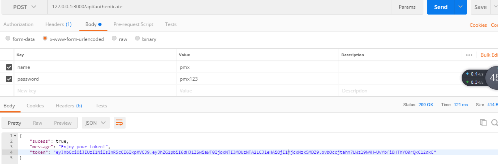

# gadget
nodejs练手小项目

## 控制台输入-中英翻译
  dictionary文件夹
  "英译汉"  node index.js today
  "汉译英"  node index.js 今天
  
## cnode社区发布评论/爬取学校网站数据
  web_crawler文件夹
  
## http做的静态资源服务
  httpServer文件夹

  
  index.js  不同路径响应不同页面，提供资源.

  index1.js 静态文件服务器，浏览器发送url,服务端解析URL,对应到硬盘上的文件。如果文件存在，返回200状态码，并发送文件到浏览器; 如果文件不存在，返回404状态码，发送一个404的文件到浏览器端。
    http提供服务，fs读取文件，Expirse/Cache-Control:max-age 使用浏览器缓存，if-Modified-Since/Last-Modified头 提高效率，较少网络流量。

## 基于JSON Web Tokens权限认证的API
  express + jwt + mongoose  因为博文的创建时间较早，一些API已经过时了，已经进行重写。

  使用nodemon依赖，启动文件nodemon server.js  当文件修改时，会自动重启项目，无需手动
  
  参考地址:https://scotch.io/tutorials/authenticate-a-node-js-api-with-json-web-tokens#toc-creating-a-sample-user

  使用postMan验证身份，并且获得token
  

  使用中间件判断是否具有权限
  url携带token，请求/api接口
  

  元数据携带token,请求/api/users接口
  

  ## 基于Node和express4的RESTful API
  项目目录 RESTful-Nodejs-Api   启动项目 nodemon server.js

  参考地:https://scotch.io/tutorials/build-a-restful-api-using-node-and-express-4

  项目进行一些修改和重写  
  
  2018/05/28补充: 使用了github的oAuth认证，只有使用github帐号进行登录才有权限获取API。

  API对应的路由和行为

  |ROUTE                | HTTP Verb | description |
  | :-----------------: | :-------: | :----------:|
  | /api/users          | GET       | 获取全部用户 |
  | /api/users          | POST      | 创建一个用户 |
  | /api/users/:user_id | GET       | 获取一个用户 |
  | /api/users/:user_id | PUT       | 更新用户信息 |
  | /api/users/:user_id | DELETE    | 删除一个用户 |

  增加新用户前,mongodb数据

  

  使用POSTMAN进行post方法测试，增加新用户
   

  增加新用户后，mongodb数据

  

  put方法测试，修改用户信息并保存
  

  delete方法测试，删除用户信息
  

## 使用socket.io做的聊天室
  Socket.io-Chat文件夹